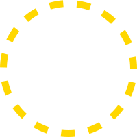

<div align="center">


# Oyama

[](https://fabricmc.net)

**Oyama** is a general utility, GUI, component and config library for modding on multi-loader.

</div>

## Installation

Add the following repository to your build file and choose the appropriate dependency for your platform.

<details>
<summary>Via Gradle (Groovy DSL)</summary>

```grovvy
repositories {
    maven { url 'https://kinhirozix.github.io/maven' }
}

dependencies {
    // Common
    implementation 'kinhiro:oyama-common:${VERSION}'
    // Fabric
    implementation 'kinhiro:oyama-fabric:${VERSION}'
    // NeoForge
    implementation 'kinhiro:oyama-neoforge:${VERSION}'
}
```

</details>
<details>
<summary>Via Gradle (Kotlin DSL)</summary>

```kotlin
repositories {
    maven("https://kinhirozix.github.io/maven")
}

dependencies {
    // Common
    implementation("kinhiro:oyama-common:${VERSION}")
    // Fabric
    implementation("kinhiro:oyama-fabric:${VERSION}")
    // NeoForge
    implementation("kinhiro:oyama-neoforge:${VERSION}")
}
```

</details>

Replace `${VERSION}` with the desired version.

## License

This project is licensed under the [Apache Public License 2.0](LICENSE).

## Contact Us

If you have any questions or suggestions, feel free to reach out:

- Github: [@kinhirozix](https://github.com/kinhirozix)
- Email: [kinhirozix@outlook.com](mailto:kinhirozix@outlook.com)
